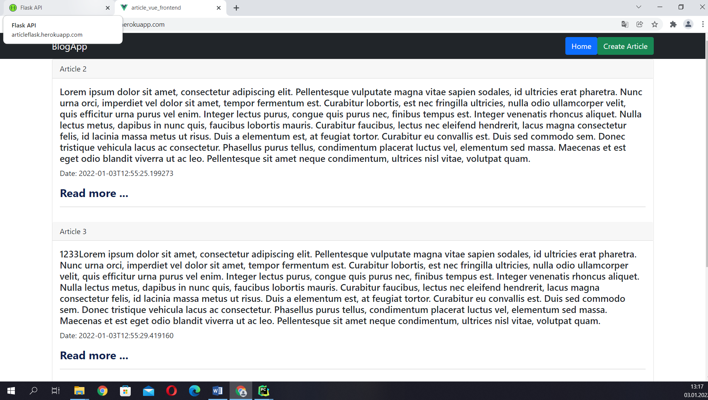
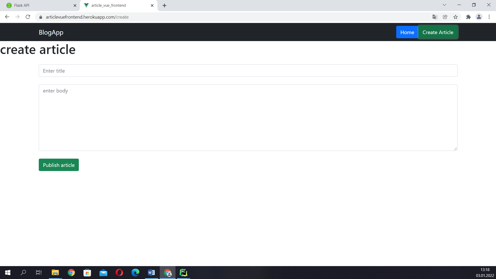
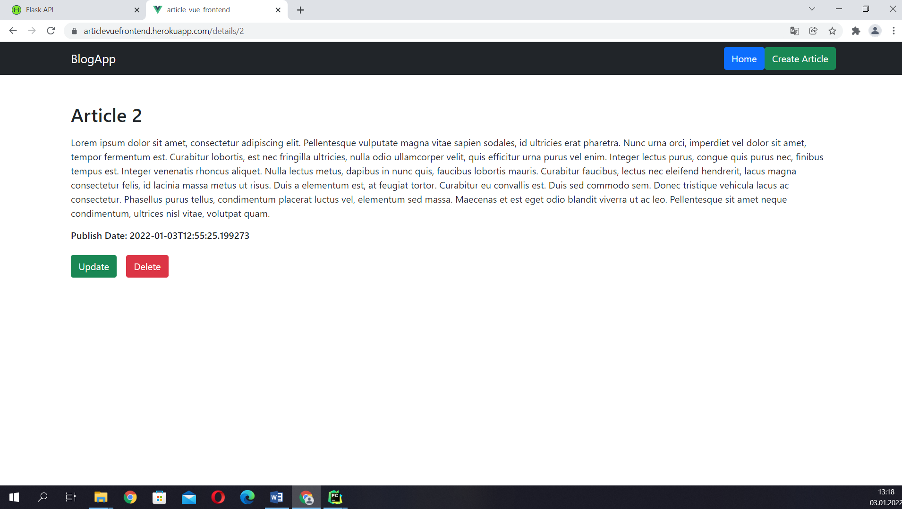
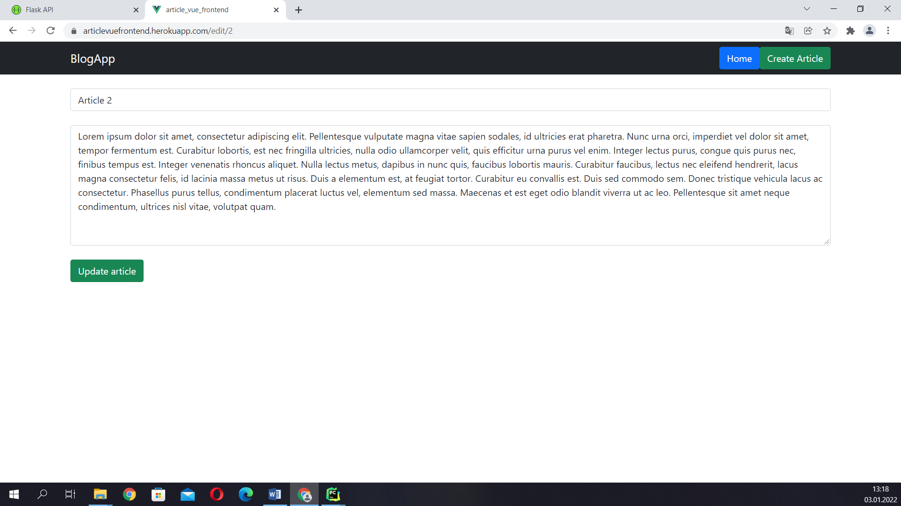

```
npm install vue-router@4
```

screenshot on heroku
====
Link [https://postvuefrontend.herokuapp.com/](https://postvuefrontend.herokuapp.com/)


1. Home Page

   
   
2. Create Article

   

3. Article

   
   
4. Update Article

   


Deploy to heroku
====

1. Install package

          npm run build
          npm i --save express serve-static


2.Create a server.js

      const express = require('express')
      const serveStatic = require('serve-static')
      const path = require('path')
      
      const app = express()
      
      //here we are configuring dist to serve app files
      app.use('/', serveStatic(path.join(__dirname, '/dist')))
      
      // this * route is to serve project on different page routes except root `/`
      app.get(/.*/, function (req, res) {
          res.sendFile(path.join(__dirname, '/dist/index.html'))
      })
      
      const port = process.env.PORT || 8080
      app.listen(port)
      console.log(`app is listening on port: ${port}`)


3. Run your node.js server

          node server.js
          "start": "node server.js"